---
layout:
  title:
    visible: true
  description:
    visible: false
  tableOfContents:
    visible: true
  outline:
    visible: true
  pagination:
    visible: true
---

# Optimizer Finance Litepaper

Website: [optimizerfinance.com](https://www.optimizerfinance.com/)

## 1. Executive Summary

The purpose of this litepaper is to provide an overview of Optimizer Finance, its current applications and projects, and future goals.&#x20;

Optimizer Finance is a research lab at the forefront of decentralized finance (DeFi) and machine learning (ML). By leveraging advanced data analytics and ML techniques, we optimize financial products and services within the DeFi ecosystem and extend these innovations to broader financial applications. Emphasizing innovation, research, and collaboration, Optimizer Finance consistently outperforms market benchmarks and delivers cutting-edge solutions to propel the DeFi sector forward.

As of current writing, Optimizer Finance has three applications which are:

* DAO Robo-Advisors
* ML-Managed Index Funds
* Domain Name Valuators

## 2. Introduction

### **Background**

Optimizer Finance began with the hypothesis that ML would enhance financial decision-making in DeFi and the blockchain industry overall. Integrating ML into the blockchain ecosystem offers opportunities to further automate processes, which aligns with the core principles of the technology. Optimizer Finance's first solution, DAO Robo-Advisors, evolved from a graduate school project focused on applying ML portfolio management strategies to improve financial decision-making within Decentralized Autonomous Organizations (DAOs). The promising results from initial hypothesis testing led to further exploration of ML integration into other areas of DeFi.   &#x20;

### **Market Context**

The DeFi space offers an environment for testing truly new and innovative concepts, with the potential for smart contracts in finance gradually being realized in traditional finance. Industry leaders are developing products using blockchain technology, including deploying on public blockchains.

In the realm of DeFi, the introduction of Real World Assets (RWA) as an asset class has created a bridge between traditional finance and blockchain-enabled financial applications. However, integrating RWAs, which are mostly non-digitally native, poses considerable friction. Domain names, being digitally native, represent a unique type of RWA. The on-chain domain registrar 3DNS allows anyone to mint a domain as a blockchain asset, enabling easy and direct trading, management, and financial applications such as collateralized loans. Domain names may be the most optimal type of RWA currently, with companies like 3DNS and top-level domains (TLDs) such as .box leading the integration of the Domain and Blockchain industries.

The introduction of large language models (LLMs) like ChatGPT and the increasing availability of affordable computing power have made ML accessible to a wider audience, allowing developers to test and develop concepts integrating ML. Traditional financial services are steadily incorporating ML into operations, with the use of robo-advisors increasing in the industry. Robo-advisors enable impartial financial analysis and can remove emotion from trading, often resulting in better returns compared to traditional strategies. The most impactful ML methods in finance have been forecasting, useful for predicting asset prices and market movements, and reinforcement learning, which has proven effective in portfolio management. With increased access to ML, we are witnessing a revolution in its application in finance.

## 3. Problem Statement

**DAO Treasury Management Issues**: Inefficiencies, risks, and complexities.  While intending to be decentralized and autonomous, many decisions, particularly financial management, are human led and driven, leading to potential conflicts of risk and collusion, a weak point in DAO governance.

**Lack of Sophisticated Tools**: Challenges in traditional asset management.  While blockchain enables digitally native financial applications, traditional methods and strategies are still prevalent in DeFi. The industry should strive to lead fintech applications.&#x20;

**Domain Valuation Challenges**: Issues in valuing web2 and web3 domains.  Web2 domain sales data is gated behind paywalls and can be expensive or difficult to access.  This makes the development of domain valuation models slower and less robust.  Further, web2 domain sales and management have serious pain points, with domains treated as if they are physical real estate instead of digital assets.   &#x20;

## 4. Solutions Offered

### **DAO Robo Advisors**

<figure>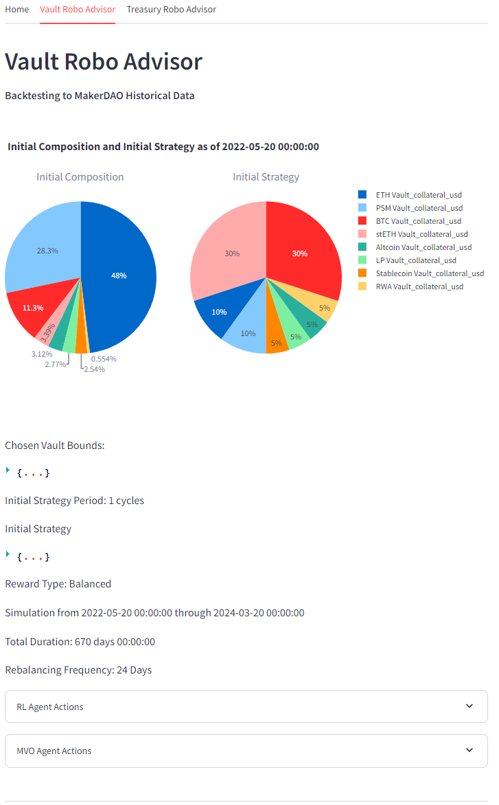<figcaption></figcaption></figure>

 

<figure>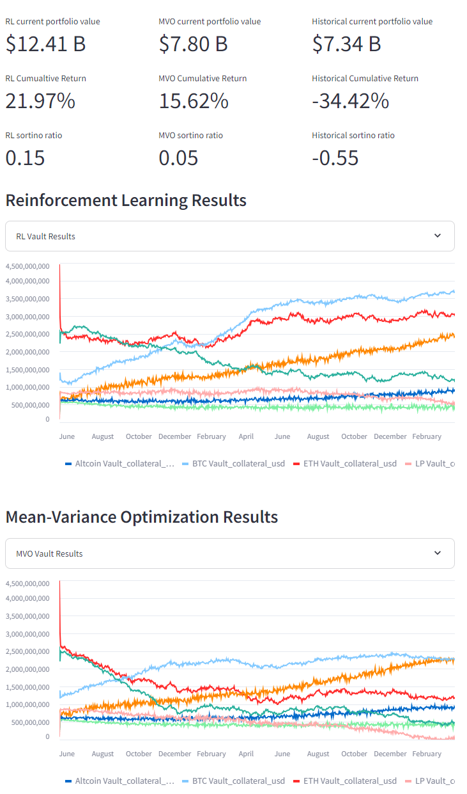<figcaption></figcaption></figure>

In an effort to enhance DAO treasury management, two robo-advisors were developed, the Vault Advisor and the Treasury Advisor.  These models were trained and backtested specifically with DAO's in mind, taking into account the unique issues in DAO financial management.  While asset prices move quickly, DAO governance does not, which can lead to serious issues in portfolio allocation. &#x20;

The Vault Advisor was designed with MakerDAO and the Maker Protocol in mind; this advisor manages the portfolio of a collateral debt position (CDP) protocol by controlling the debt ceilings of several vaults within the protocol.  This is meant to drive deposits and withdrawals to certain vaults in the portfolio, targeting an optimized portfolio informed by advanced financial calculations.  The goal is to balance growth and stability for CDP protocols. &#x20;

The Treasury Advisor was developed for direct portfolio rebalancing, allowing the DAO to control key parameters such as investible assets, rebalancing frequency, and portfolio constraints, enabling hybrid risk management. &#x20;

#### **Methodology**

At the core of these models are mean-variance optimization (MVO) and reinforcement learning (RL).  MVO is employed to achieve an optimal portfolio allocation, focusing specifically on attaining an optimal Sortino ratio, which emphasizes minimizing portfolio downside risk.  RL enables the advisor to learn from its actions and dynamically tweak its strategy given the results of prior actions.  The Vault Advisor uses a custom built RL model utilizing Q-learning, whereas the Treasury Advisor combines OpenAI's gym.env environment with a Proximal Policy Optimization (PPO) RL model. &#x20;

The Vault Advisor leverages a forecasting model as the core of a simulator to predict the effects of debt ceiling adjustments on the protocol's vaults. This approach facilitates comprehensive backtesting of the model, allowing for comparisons between historical performance and results managed by the robo-advisor. &#x20;

#### **Performance Metrics**

Backtesting for the robo-advisors showed improved portfolio returns and lower downside risk, demonstrated by higher cumulative returns and Sortino ratio metrics compared to the historical data. &#x20;

_**Treasury Advisor**_

Averaging the results of 10 runs over 10 different seeds with a 15-day rebalance frequency, the Treasury Advisor achieved an average cumulative return of 120% from March 22, 2023, through May 15, 2025, and an average Sortino ratio of 3.45. In comparison, the backtested PanamaDAO, which allocated 99% to ETH during the same period, achieved a cumulative return of 61.80% and a Sortino ratio of 1.81. The Treasury Advisor also demonstrated a superior market risk-adjusted strategy with a Beta of 2.7 and a compound annual growth rate (CAGR) of 145%, compared to the DAO's Beta of 1.74 and CAGR of 63.39%. Several DAO Treasury indices were created for benchmarking purposes; the average RL portfolio outperformed all but one index in terms of returns and market risk.

<figure><figcaption>
Portfolio composition for one run
</figcaption></figure>

 

<figure><figcaption>
Cumulative returns of each run
</figcaption></figure>

 

<figure><figcaption>
Normalized, averaged returns of each run
</figcaption></figure>

 

<figure><figcaption>
Beta and CAGR of averaged returns in Security Market Line visualization
</figcaption></figure>

#### _Vault Advisor_

Averaging the results of 10 runs, the Vault Advisor also achieved outsized returns and lower downside risk. Over the test period from May 20, 2022, to March 20, 2024, the RL model's average cumulative return was -19%, with a Sortino ratio of -0.22 and a Total Value Locked (TVL) of $10,629,002,211. In comparison, the Maker Protocol's historical performance during the same period showed a cumulative return of -34%, a Sortino ratio of -0.55, and a TVL of $7,342,533,784.

<figure>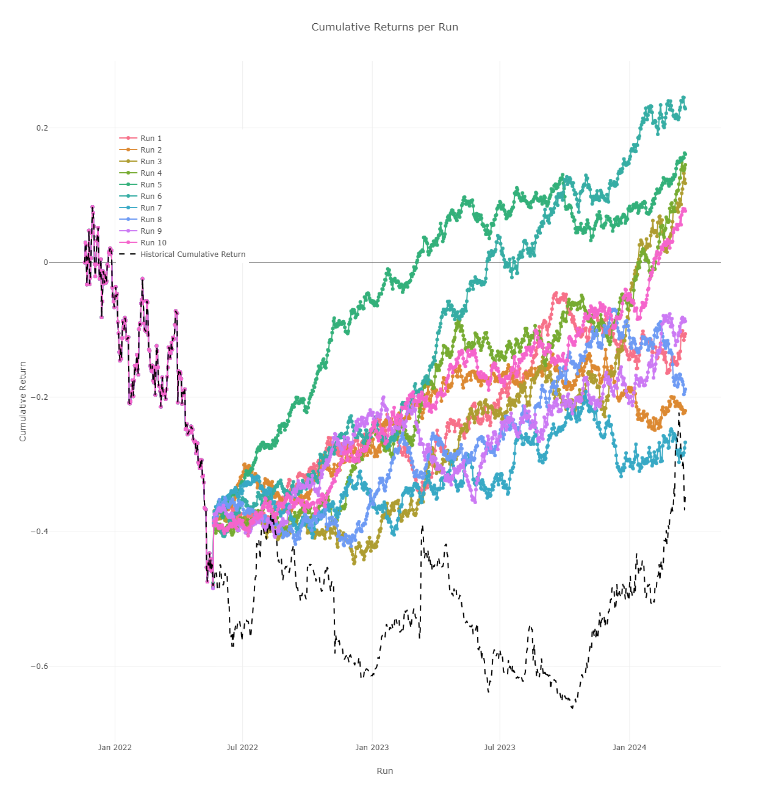<figcaption>
Cumulative returns of each run
</figcaption></figure>

 

<figure>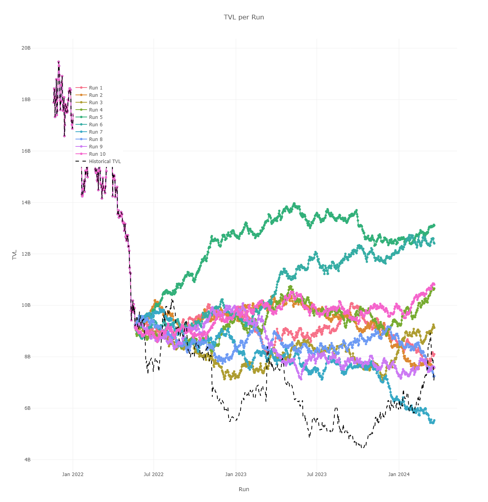<figcaption>
TVL of each run
</figcaption></figure>

 

<figure>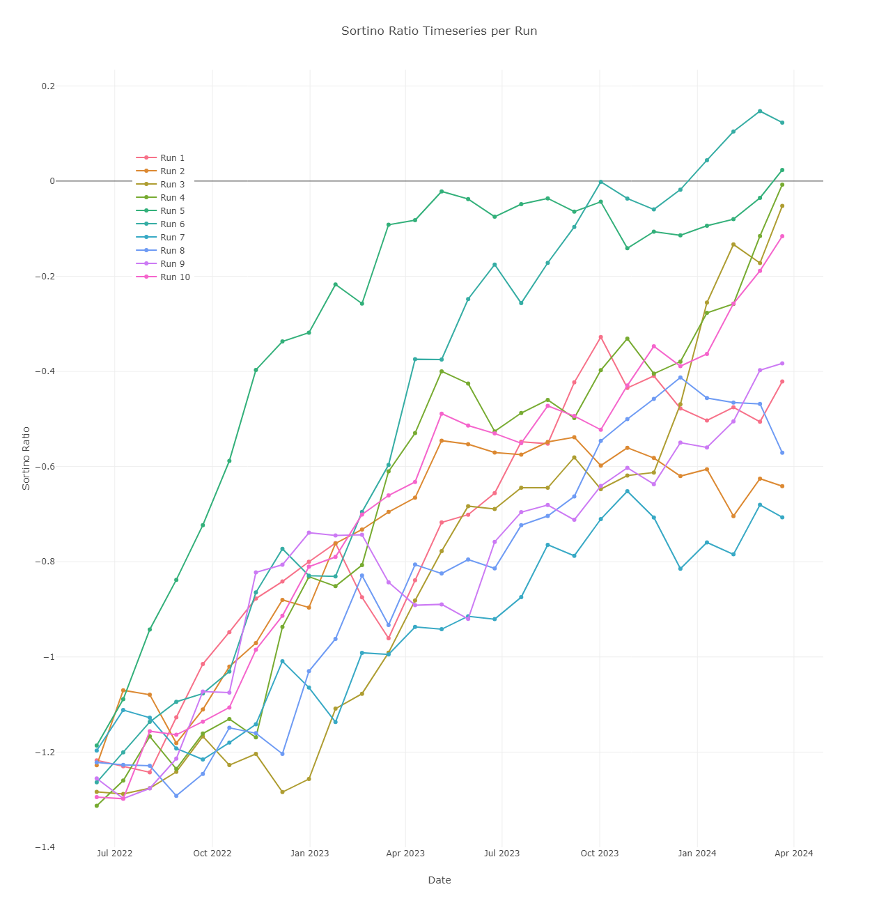<figcaption>
Sortino ratios of each run
</figcaption></figure>

### **Liquid Staking Token (LST) Index**

<figure>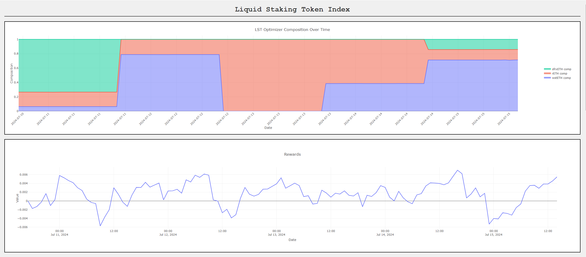<figcaption></figcaption></figure>

<figure>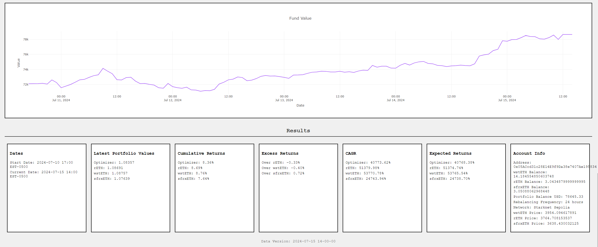<figcaption></figcaption></figure>

This project was developed during StarkHack 2024, with the goal of simplifying and streamlining the process to gain the best exposure to Ethereum LSTs.  The index fund is managed by a ML model which uses Value at Risk/Conditional Value at Risk (VaR/CVaR), time series forecasting, and RL to chose an optimal portfolio of LSTs.  VaR/CVaR is used to inform the model of the potential losses associated with a portfolio, whereas forecasting is used to anticipate future asset prices in a bid to reduce portfolio losses.  This information is fed to the RL model, which makes an optimal portfolio allocation given these results and calculations.  The RL model is currently able to choose from wstETH, rETH, and sfrxETH, considered to be the LSTs with adequate liquidity and least custody risk.  &#x20;

#### **Technology Stack**

The model operates within a gym.env environment, where a PPO RL model uses VaR/CVaR and forecasting results to inform portfolio allocation decisions.  The model accepts several parameters, principally rebalancing frequency, and outputs an action representing the target portfolio composition for the period. &#x20;

The model and environment are imported into a Flask app which receives hourly price data for the LSTs via Flipside API.  The model is connected to a wallet on the Starknet Sepolia testnet using the Starknet.py Python SDK; once the model makes the action, the script translates that action into a new target balance, and affects the necessary swaps to achieve the target composition.  Once the new composition is achieved for the fund, key data is captured and visualized on the Javascript front-end.  This includes hourly portfolio composition, model rewards, normalized comparison to LSTs, forecasted prices, fund value, and excess returns over the LSTs. &#x20;

#### **Performance Results**

Averaging 10 runs with 10 different random seeds from January 10, 2023, through June 18, 2024, the index achieved an average cumulative return of 43% over rETH, 36% over wstETH, and 35% over sfrxETH. By the end of the period, the index attained a CAGR of 125%, compared to 103% for rETH, 107% for wstETH, and 107% for sfrxETH. &#x20;

<figure>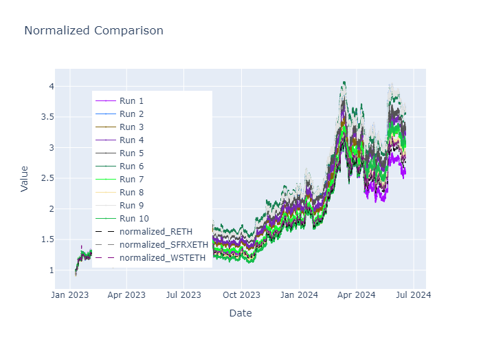<figcaption>
Results of Each Run
</figcaption></figure>

 

<figure>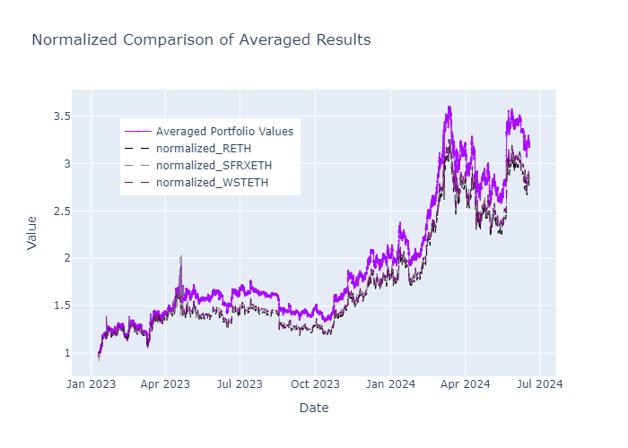<figcaption>
Averaging the 10 Runs
</figcaption></figure>

### **Domain Valuator**

<figure>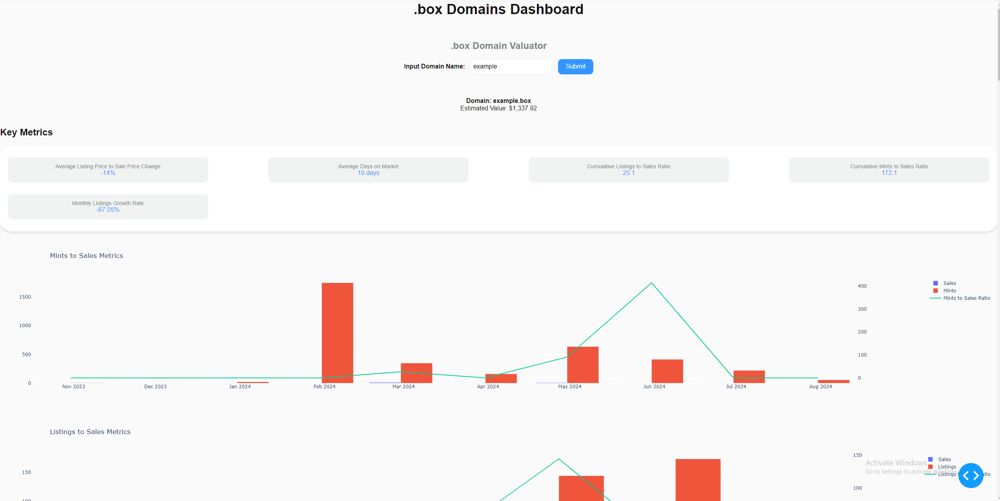<figcaption></figcaption></figure>

The domain valuator tool emerged from preliminary data analysis on the 3DNS domains market. Based on this data and the thesis that on-chain domains are optimal RWAs, the tool aims to provide a fair value for a domain. This enhances liquidity by giving buyers and sellers an estimate of a domain's worth. The end user simply inputs the domain name they want to value, and the model generates an estimate.

#### **Integration**

The specific ML model in use is ridge linear regression. It was trained on a dataset of web2 domain sales dating back to 1994, which includes hundreds of thousands of domain sales, along with sales data from 3DNS domains. By fitting this historical data, the model estimates the value of a given domain based on characteristics such as length and top-level domain (TLD).

#### **Current Progress**

The model is currently being used to value .box domains as part of a .box dashboard, but it has broader implications and can be configured to value any domain name. Work is underway to automatically detect 3DNS domains in a given wallet and estimate the worth of the wallet's portfolio. Further development to enhance its accuracy scores on historical data should optimize the estimations. Once the model is performing optimally, it has the potential to serve as a price reference for on-chain domains, enabling its use in DeFi applications such as collateralized loans/CDPs. This would also facilitate the inclusion of on-chain domains in DAO treasuries, supporting the thesis of on-chain domains as optimal RWAs.     &#x20;

## 5. Technical Architecture

### **DAO Robo-Advisors**

#### **Architecture**

This project is live in the form of a Streamlit app which allows a user to configure their own robo advisor and compare results to historical data and benchmarks.  An on-chain app could be implemented as either a stand alone fund in which a DAO would buy a share, or integrated directly into a DAO treasury to rebalance a specified wallet address. &#x20;

<figure>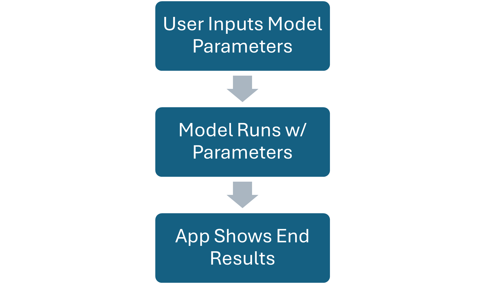<figcaption>
Streamlit App Flow
</figcaption></figure>

#### **Data Handling and Model Overview**

_**Vault Advisor**_

The Vault Advisor uses a simulation component to backtest the model's strategy. This simulator employs multiple linear regression with ridge tuning and incorporates stochastic variables such as moving average volatility to simulate changes in vault balances due to debt ceiling adjustments. The forecasting model was trained on tens of thousands of data points from on-chain data analysis of the Maker core accounting system (VAT), existing dashboards and protocol data queries, and macroeconomic and crypto market data, including risk-free rates, CPI, and market volume.

Operating on a 24-day rebalance strategy, the model calculates MVO target weights, portfolio return, and Sortino ratio every 24 days, which are then translated into a reward. Based on this reward, the model selects a debt ceiling adjustment strategy that targets an optimal portfolio composition. For instance, Sortino ratio calculations for each vault might target reduced capital in the ETH vault and increased capital in the BTC vault. Consequently, the model will decrease the ETH vault and increase the BTC vault over the 24-day period.

The custom RL model begins training by making random actions during the initial 24-day cycles, using the outcomes to develop an optimal policy and continuously refining its strategy based on these results.

<figure>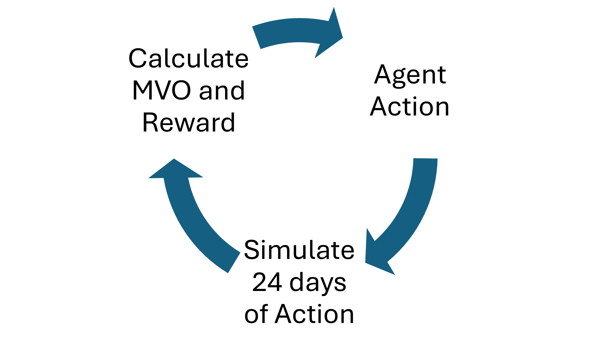<figcaption>
Vault Advisor Cycle
</figcaption></figure>

_**Treasury Advisor**_&#x20;

The Treasury Advisor takes a more direct approach to portfolio rebalancing. DAO treasury indices and benchmarks are created by calculating the weighted daily returns of treasury assets across various DAOs by sector, aggregating these returns to form a sector index. The model targets specific portfolio compositions in an attempt to smooth over cash flows that could impact the DAO treasury balance, and calculates returns in the same manner as the DAO treasury indices. Given the rebalance parameter, the model generates actions and relies on a combined Sortino ratio and portfolio return reward as feedback. Unlike the Vault Advisor, this model allows for direct swaps into the target portfolio composition, eliminating the need for a simulation model.

After the model runs for the specified start and end date, the final portfolio return, Sortino ratio, and normalized returns are calculated and compared with the DAO treasury indices. Additionally, a security market line visualization is created to compare portfolio performance in terms of the capital asset pricing model. The model is initially trained and fitted on historical data to develop an optimal policy for the environment. Once a well-performing model is established, it is deployed in a test run.

<figure>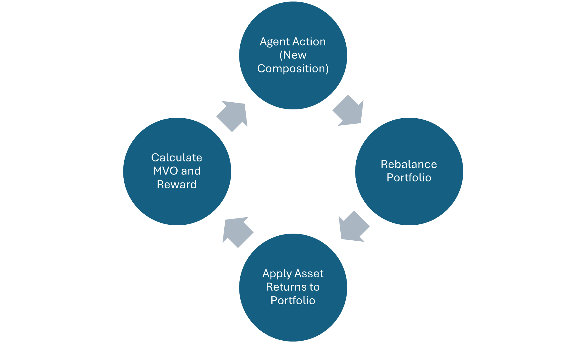<figcaption>
Treasury Advisor Cycle
</figcaption></figure>

### **LST Index**

#### **Environment Setup**

This model is a customized extension of the Treasury Advisor. Instead of focusing on and being backtested against DAO treasury performance, it targets an optimal portfolio of Liquid Staking Tokens (LSTs) to provide the best exposure to the asset class. The model receives hourly data, generating rewards and forecasts accordingly, and rebalances based on the specified rebalance frequency parameter.

The model was trained and fitted to historical data from January 2023 through June 2024 to develop an optimal policy for the environment. This optimized model was then deployed on live data. Initial backtesting indicated that a 24-hour rebalance frequency yielded the best performance.&#x20;

#### **Forecasting and Blockchain Integration**

The index fund was deployed on the Starknet Sepolia testnet and rebalances a wallet address using testnet ERC20 tokens representing wstETH, rETH, and sfrxETH. Hourly data is received from a Flipside API, and model actions are translated into on-chain swaps. A second Flask app and wallet address were deployed to represent a DEX holding balances for the testnet ERC20 tokens. The RL Flask app sends the logical amount of tokens to the DEX, and the DEX sends back the necessary amount to reach the target balance, utilizing price feeds from the Flipside API.

A Prophet library univariate forecasting model was backtested to predict the prices for the respective LSTs. This fitted model was then deployed in the live RL model environment.

#### **Flask App**

Every hour the Flask app updates, which then sends the new data to a Javascript front-end for visualization.  The data is cached hourly, ensuring synchronization between the two scripts. &#x20;

<figure>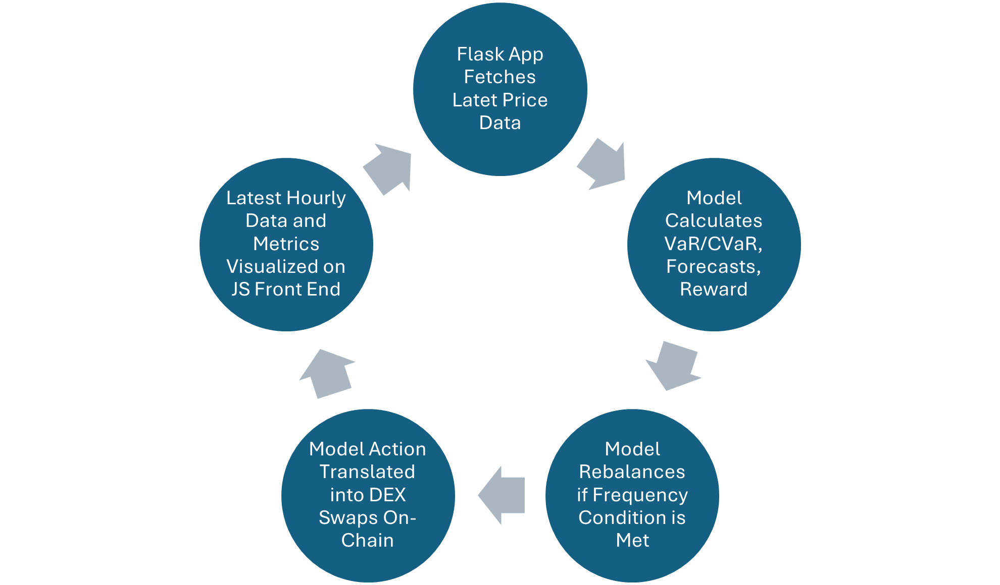<figcaption>
LST Index Cycle
</figcaption></figure>

### **Domain Valuator**

#### **Script and App**

The current iteration of the domain valuator is a ridge regression model that utilizes web2 and web3 domain sales, going back to 1994.  Features including domain length and TLD are engineered for each domain, and the model is trained on the robust data set to be able to estimate the value of a given domain name.

While the ridge regression model scored the highest on accuracy metrics, other estimation models and technologies such as Prophet and LSTM models are being considered. &#x20;

<figure>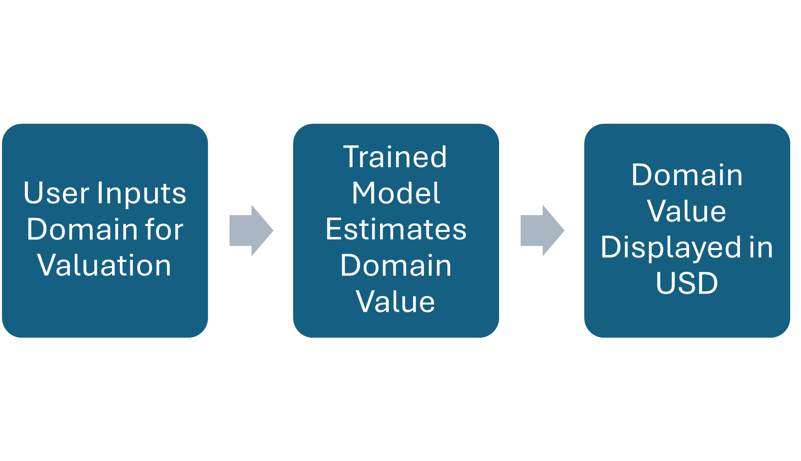<figcaption>
Dash App Flow
</figcaption></figure>

#### **Data Integration**

The web2 data was obtained via a .tsv file containing hundreds of thousands of data points, while the web3 data is sourced directly on-chain from 3DNS domain sales. This data is then integrated into a comprehensive dataset. In the future, web2 domain sales can be obtained via API for more dynamic training, whereas web3 domains can already be dynamically obtained and updated due to the open nature of blockchain data. &#x20;

<figure>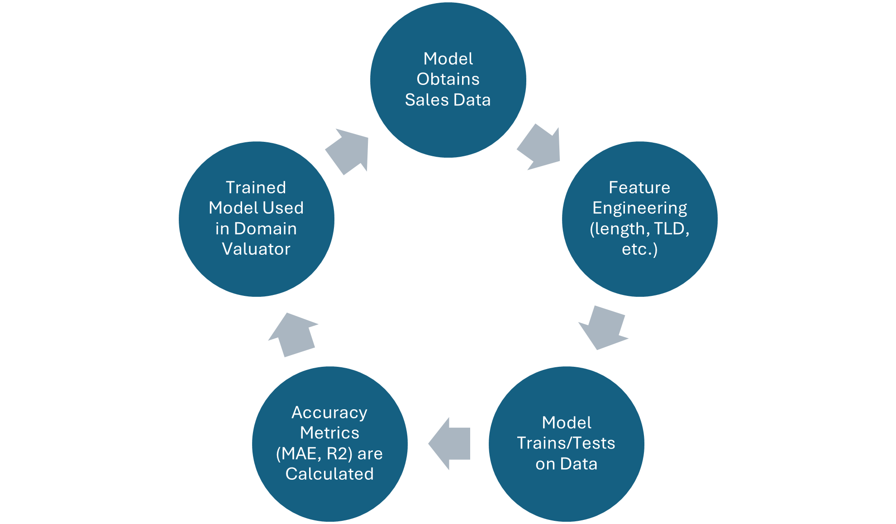<figcaption>
Model Training Cycle
</figcaption></figure>

## 6. Revenue Model

### **Revenue Streams**

#### **DAO Robo Advisors**

There are two ways to implement the Treasury Robo Advisors for production use. One approach is direct integration with a DAO treasury, where the wallet address is owned by the DAO but managed by the robo-advisor. This allows a DAO to have its own directly managed treasury address and utilize a robo-advisor controlled vault, with the treasury divided between the DAO-managed address and the robo-advisor managed address. Another option is to deploy the Treasury Robo Advisors independently as a sort of mutual fund, where a DAO can gain exposure by buying shares. In either scenario, a flat management fee could be collected upfront upon first deployment and/or on a regular basis (subscription-style fee), and a performance fee based on the robo-advisor's excess return over an index or benchmark could also be collected.

Similarly, the Vault Robo Advisor could operate as its own vault or multiple vaults managed by the AI within the existing CDP protocol. The DAO could choose which vaults to deploy the robo-advisor in, enabling hybrid financial management between the advisor and the DAO. Alternatively, the Vault Robo Advisor could function without directly controlling a vault, instead monitoring the financial health and key metrics of the CDP protocol and making recommendations to the DAO, potentially even proposing actions via governance. The extent of the robo-advisor's integration into financial management would be up to the DAO. A flat management fee could be collected upfront or on a subscription basis, with a performance fee based on excess return over an index or benchmark.

#### **LST Index**

Users would gain exposure by purchasing shares in the fund. A management fee, as a percentage of the deposit, could be collected upfront to cover gas and overhead costs. Upon withdrawal, a performance fee based on excess return over the LSTs could also be collected.

To ensure the health of the fund, a third recurring fee may be necessary to cover ongoing gas fees and overhead costs, as the previously mentioned fees are only collected upfront or upon withdrawal, leaving no revenue collected in the meantime. It may be practical to charge the management fee upfront and potentially on a monthly basis. Potential fee structures will need to be modeled to ensure success without dis-incentivizing usage.

#### **Domain Valuator**

A fee could be collected for using the domain valuator. Additionally, the valuator could serve as a price oracle for on-chain domains, allowing protocols and entities to pay for its usage in this capacity. In the future, we anticipate that the domain valuator could be integrated into CDP protocols specifically for on-chain domains.&#x20;

### **Business Model**

## 7. Roadmap and Future Work

### **Short-term Goals**: Upcoming features and developments.

* **Test Net Implementation of DAO Robo-Advisors**
  * **Treasury Advisor:** More straightforward, similar to the LST Index.
  * **Vault Advisor:** Less so; requires a test net environment with test net participants.
* **DAO Robo-Advisor Pilots**
  * **Treasury Advisor:** A DAO willing to utilize the advisor for treasury management.
  * **Vault Advisor:** A CDP protocol (e.g., Maker, Open Dollar) willing to pilot robo-advised vaults.
* **Further Backtesting of LST Index**
  * Optimize parameters such as rebalance frequency and model fit.
* **Creation of Trading/Technical Analysis Strategy for LST**
  * Aiming to minimize slippage. Currently, trades are made all at once; may need to spread trades over the hour and across several exchanges.
* **Create Smart Contract to Mint Fund Shares**
  * For users who deposit into the fund.
* **Integration of More Data into Domain Valuator**
  * Further model testing, tuning, and feature engineering to increase accuracy on historical data.

### **Long-term Vision**: Expansion plans and future offerings.

* LST v1 on mainnet Starknet or other network&#x20;
* DAO Robo Advisors live on several DAO treasuries/vaults&#x20;
* Creation of CDP protocol for on chain domains, utilizing domain valuator as price feed&#x20;

## 8. Team

### **Founders and Developers**

* Sole Developer/Founder:
  * Brandyn Hamilton - Experienced Python Developer and Data Analyst specializing in financial data analytics, machine learning, and decentralized finance systems. With over seven years of experience in financial analysis, real estate, and research, I hold a Master of Science in Management with a focus on Financial Technology. Expert in leveraging Python and SQL for developing financial and analytical solutions. Recently recognized as a semi-finalist at StarkHack 2024 for pioneering a machine learning managed index fund of Liquid Staking Tokens
    * Linkedin: [https://www.linkedin.com/in/brandyn-hamilton/](https://www.linkedin.com/in/brandyn-hamilton/)
    * Twitter: [https://x.com/Bhami628](https://x.com/Bhami628)
    * Github: [https://github.com/BrandynHamilton](https://github.com/BrandynHamilton)
    * [CV/Portfolio](https://silky-mambo-09e.notion.site/Brandyn-Hamilton-s-Portfolio-df15c30377f1427ebe1dcff4f1ef7c63)&#x20;

### **Advisors and Partners**

* No advisors or partners at this time

## 9. Contact Information

* **Website**: [optimizerfinance.com](https://www.optimizerfinance.com)
* **Email**: BrandynHam1120@gmail.com
* **Social Media**: Links to GitHub and other relevant profiles.
  * Optimizer Finance Github: [https://github.com/enterprises/daoroboadvisor](https://github.com/enterprises/daoroboadvisor)

## 10. Appendices

* **DAO Robo Advisor Results**: Detailed performance results.
  * [https://robo-advisor-labs.gitbook.io/dao-robo-advisor-whitepaper/vault-robo-advisor-results](https://robo-advisor-labs.gitbook.io/dao-robo-advisor-whitepaper/vault-robo-advisor-results)
  * [https://robo-advisor-labs.gitbook.io/dao-robo-advisor-whitepaper/treasury-robo-advisor-results](https://robo-advisor-labs.gitbook.io/dao-robo-advisor-whitepaper/treasury-robo-advisor-results)
* **LST Index Results**: Comprehensive results and comparisons.
  * [https://robo-advisor-labs.gitbook.io/lst-index/lst-index-results](https://robo-advisor-labs.gitbook.io/lst-index/lst-index-results)
* **Technical References**: Additional technical documentation and resources.

